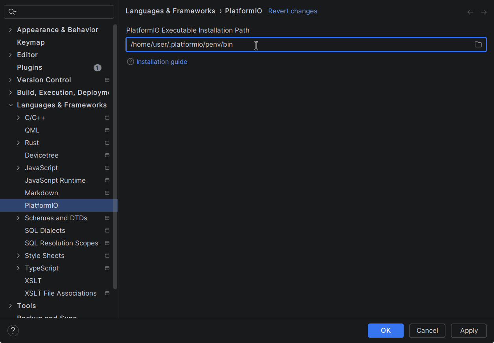

# Mbed OS with PlatformIO and CLion

We like using CLion for our C/C++ projects. For embedded projects, PlatformIO provides support for many development
boards and frameworks, including Mbed OS. Unfortunately, Mbed OS is now unmaintained and doesn't support modern versions
of Python. Here's how we worked around this.

## Requirements

* CLion IDE
* PlatformIO plugin for CLion (this appears to be bundled with the latest versions of CLion, otherwise it can be
  installed from the plugin marketplace)

## Creating a project

We start by creating a new PlatformIO project in CLion, selecting our target board and `mbed` as the framework:


This is where we hit problems. We had been using an installation of PlatformIO and, crucially, Python from our Linux
distribution's repositories. Since Mbed OS is no longer maintained, it has not been updated to support modern versions
of Python, and we receive the following error when CLion attempts to configure the project:

```terminaloutput
UserSideException: Processing nucleo_f439zi (platform: ststm32; board: nucleo_f439zi; framework: mbed)
--------------------------------------------------------------------------------
Verbose mode can be enabled via `-v, --verbose` option
CONFIGURATION: https://docs.platformio.org/page/boards/ststm32/nucleo_f439zi.html
PLATFORM: ST STM32 (19.4.0) > ST Nucleo F439ZI
HARDWARE: STM32F439ZIT6 180MHz, 192KB RAM, 2MB Flash
DEBUG: Current (stlink) On-board (stlink) External (blackmagic, cmsis-dap, jlink)
PACKAGES: 
 - framework-mbed @ 6.61700.231105 (6.17.0) 
 - toolchain-gccarmnoneeabi @ 1.90201.191206 (9.2.1)
ModuleNotFoundError: No module named 'imp':
  File "/usr/lib/python3.14/site-packages/platformio/builder/main.py", line 173:
    env.SConscript("$BUILD_SCRIPT")
  File "/home/user/.platformio/packages/tool-scons/scons-local-4.8.1/SCons/Script/SConscript.py", line 620:
    return _SConscript(self.fs, *files, **subst_kw)
  File "/home/user/.platformio/packages/tool-scons/scons-local-4.8.1/SCons/Script/SConscript.py", line 280:
    exec(compile(scriptdata, scriptname, 'exec'), call_stack[-1].globals)
  File "/home/user/.platformio/platforms/ststm32/builder/main.py", line 120:
    target_elf = env.BuildProgram()
  File "/home/user/.platformio/packages/tool-scons/scons-local-4.8.1/SCons/Util/envs.py", line 252:
    return self.method(*nargs, **kwargs)
  File "/usr/lib/python3.14/site-packages/platformio/builder/tools/piobuild.py", line 61:
    env.ProcessProgramDeps()
  File "/home/user/.platformio/packages/tool-scons/scons-local-4.8.1/SCons/Util/envs.py", line 252:
    return self.method(*nargs, **kwargs)
  File "/usr/lib/python3.14/site-packages/platformio/builder/tools/piobuild.py", line 122:
    env.BuildFrameworks(env.get("PIOFRAMEWORK"))
  File "/home/user/.platformio/packages/tool-scons/scons-local-4.8.1/SCons/Util/envs.py", line 252:
    return self.method(*nargs, **kwargs)
  File "/usr/lib/python3.14/site-packages/platformio/builder/tools/piobuild.py", line 353:
    SConscript(env.GetFrameworkScript(name), exports="env")
  File "/home/user/.platformio/packages/tool-scons/scons-local-4.8.1/SCons/Script/SConscript.py", line 684:
    return method(*args, **kw)
  File "/home/user/.platformio/packages/tool-scons/scons-local-4.8.1/SCons/Script/SConscript.py", line 620:
    return _SConscript(self.fs, *files, **subst_kw)
  File "/home/user/.platformio/packages/tool-scons/scons-local-4.8.1/SCons/Script/SConscript.py", line 280:
    exec(compile(scriptdata, scriptname, 'exec'), call_stack[-1].globals)
  File "/home/user/.platformio/platforms/ststm32/builder/frameworks/mbed.py", line 35:
    SConscript(
  File "/home/user/.platformio/packages/tool-scons/scons-local-4.8.1/SCons/Script/SConscript.py", line 684:
    return method(*args, **kw)
  File "/home/user/.platformio/packages/tool-scons/scons-local-4.8.1/SCons/Script/SConscript.py", line 620:
    return _SConscript(self.fs, *files, **subst_kw)
  File "/home/user/.platformio/packages/tool-scons/scons-local-4.8.1/SCons/Script/SConscript.py", line 280:
    exec(compile(scriptdata, scriptname, 'exec'), call_stack[-1].globals)
  File "/home/user/.platformio/packages/framework-mbed/platformio/platformio-build.py", line 37:
    from pio_mbed_adapter import PlatformioMbedAdapter
  File "/home/user/.platformio/packages/framework-mbed/platformio/pio_mbed_adapter.py", line 52:
    from tools.build_api import prepare_toolchain, UPDATE_WHITELIST
  File "/home/user/.platformio/packages/framework-mbed/tools/build_api.py", line 48:
    from .libraries import Library
  File "/home/user/.platformio/packages/framework-mbed/tools/libraries.py", line 25:
    from tools.tests import TEST_MBED_LIB, DEFAULT_SUPPORT
  File "/home/user/.platformio/packages/framework-mbed/tools/tests.py", line 18:
    from past.builtins import cmp
  File "/home/user/.platformio/packages/framework-mbed/platformio/package_deps/py3/past/builtins/__init__.py", line 54:
    from past.builtins.misc import (apply, chr, cmp, execfile, intern, oct,
  File "/home/user/.platformio/packages/framework-mbed/platformio/package_deps/py3/past/builtins/misc.py", line 45:
    from imp import reload
========================== [FAILED] Took 0.68 seconds ==========================


```

The problem here is that Mbed studio has not been updated for recent versions of Python, yet we are running the latest:

```shell
$ python --version
Python 3.14.2
```

## Install an older version of Python

To work around this, we get an older version of Python. We don't want to globally downgrade the version of Python on our
system, since this would break Python applications that depend on a more recent Python interpreter. Fortunately, tooling
exists for maintaining multiple Python installations at different versions. We used [pyenv](https://github.com/pyenv/pyenv)
for this. Our pyenv was installed from our Linux distribution's repositories, though alternate installation methods are
described in pyenv's README. For Windows, there is a separate [pyenv-win](https://github.com/pyenv-win/pyenv-win) fork.

With pyenv installed and configured, we use it to install the latest version of Python 3.9, which is known to work with
Mbed OS:

```shell
$ pyenv install 3.9
Downloading Python-3.9.25.tar.xz...
```

A few minutes later, the installation should complete.

## Install PlatformIO using this version

Now we can install PlatformIO based on the Python version we just installed. Again, we don't want to globally override
our system Python installation, so we can use the `pyenv shell` command to affect just the current shell:

```shell
$ pyenv shell 3.9.25 # Replace with the version that actually got installed if necessary
$ python --version
Python 3.9.25 # Excellent! We can use this shell to install PlatformIO
```

The PlatformIO developers provide a Python script for installation. This is the method we used. The script installs
PlatformIO in a Python [venv](https://docs.python.org/3/library/venv.html), so this will not interfere with anything we
have installed system-wide. Platform-specific instructions for using the installer script can be found [here](https://docs.platformio.org/en/latest/core/installation/methods/installer-script.html).

So we download and run the script in our shell configured for Python 3.9:

```shell
$ curl -fsSL -o get-platformio.py https://raw.githubusercontent.com/platformio/platformio-core-installer/master/get-platformio.py
$ python get-platformio.py
```

The script will then create the venv and install the necessary Python packages. At the end, it'll spit out some
information about the installation:

```terminaloutput
PlatformIO Core has been successfully installed into an isolated environment `/home/user/.platformio/penv`!

The full path to `platformio.exe` is `/home/user/.platformio/penv/bin/platformio`

If you need an access to `platformio.exe` from other applications, please install Shell Commands
(add PlatformIO Core binary directory `/home/user/.platformio/penv/bin` to the system environment PATH variable):

See https://docs.platformio.org/page/installation.html#install-shell-commands
```

On Linux, udev rules also need to be configured. Instructions for doing this can be found [here](https://docs.platformio.org/en/latest/core/installation/udev-rules.html).
We didn't need to do this, since we also have a system-wide installation of PlatformIO from our package manager, which
already includes the udev rules.

## Configure the CLion PlatformIO plugin

Now all we need to do is point the PlatformIO plugin for CLion at the `bin` directory containing our local PlatformIO
installation which we obtain from the information output by the `get-platformio.py` script:



Once this setting is applied, CLion should be able to configure the project successfully, and we can use the integrated
tooling to build upload, debug, etc.
